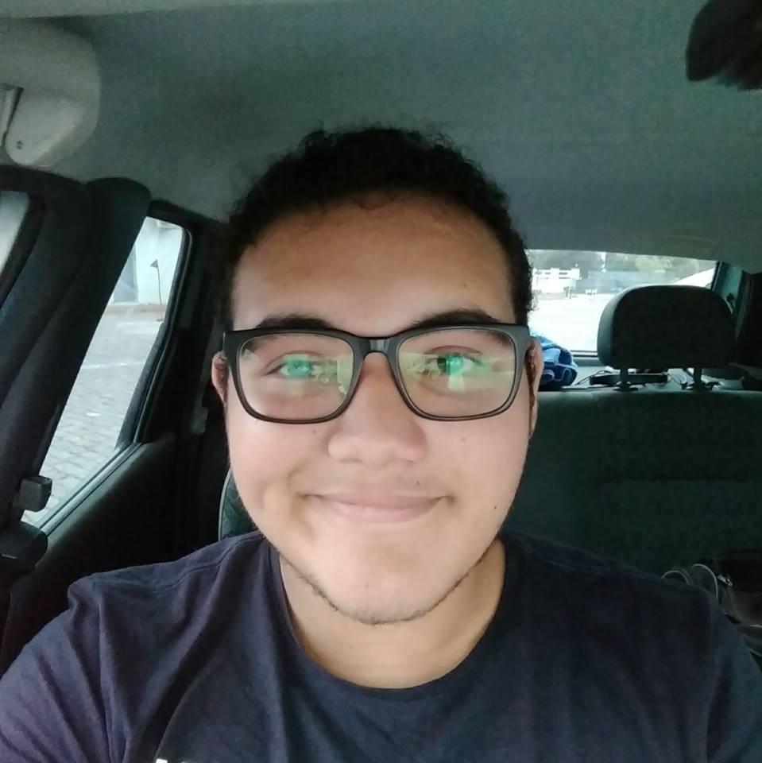
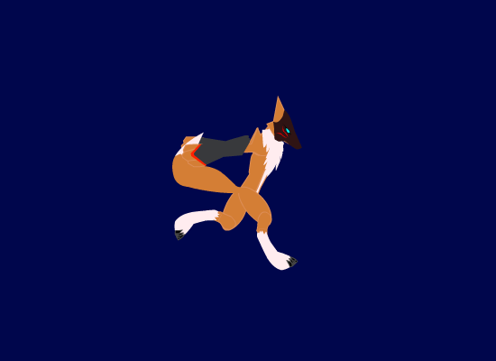
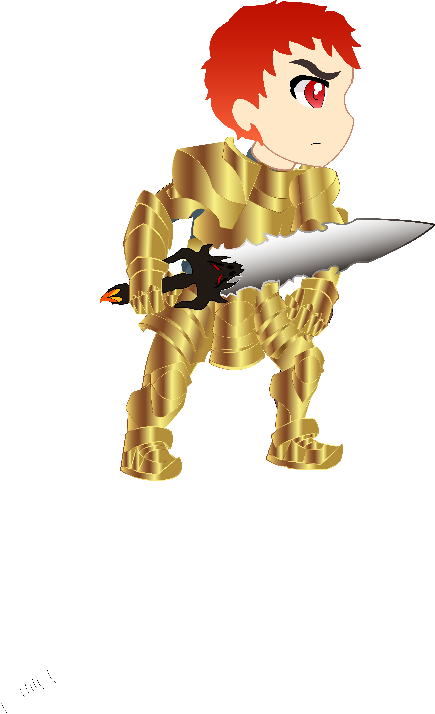
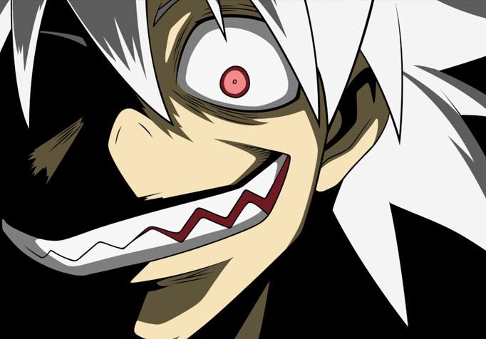
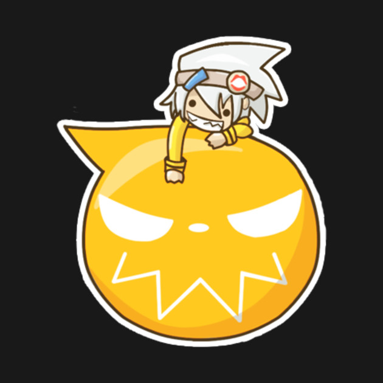

# Portifólio:
 
## Anthony Gabriel de Lima, 17 anos.

# Sobre mim:
 Estudante do IFRN, curso de programação de jogos, e estagiário em desenvolvimento Web, também sou artista 2D
 e jogos games online nas horas vagas, tenho no momento 4 jogos feitos para trabalhos em sala de aula, almejo
 um dia ser um grande programador de jogos e também um excelente desenvolvedor Web. A seguir acompanhe alguns dos
 meus trabalhos e também meus contatos.

# Artes feitas:
A este eu dei o nome de Rapozão, foi um person de um jogo que não ficou pronto, mas me orgulho dele:

Este é o personagem que deveria ser um novo deus da mitologia grega,nome dele é Asbros:

# Contatos

1. E-mail: tryout3699@gmail.com
2. Facebook:
<a href = "https://www.facebook.com/anthony.gabriel.1272" target = "_blank">  Clique aqui  </a> para ir ao meu facebook!

# Alguns de meus jogos: 
 <!-- 1. Adicionar um Link (url):
  [Clique aqui](https://pbs.twimg.com/profile_images/505770595422699521/n8bFETLR.jpeg)-->
  
 <!-- 2.Adicionar uma imagem da internet:
  -->
  
  <!--3. Adicionar uma imagem do computador (arquivo):
  -->
 
  <!--4.Adicionar um link que seja a imagem:
  -->
  
  <!--5.Adicionar um link que seja a imagem e que abra em uma nova guia:
   -->
  
  

